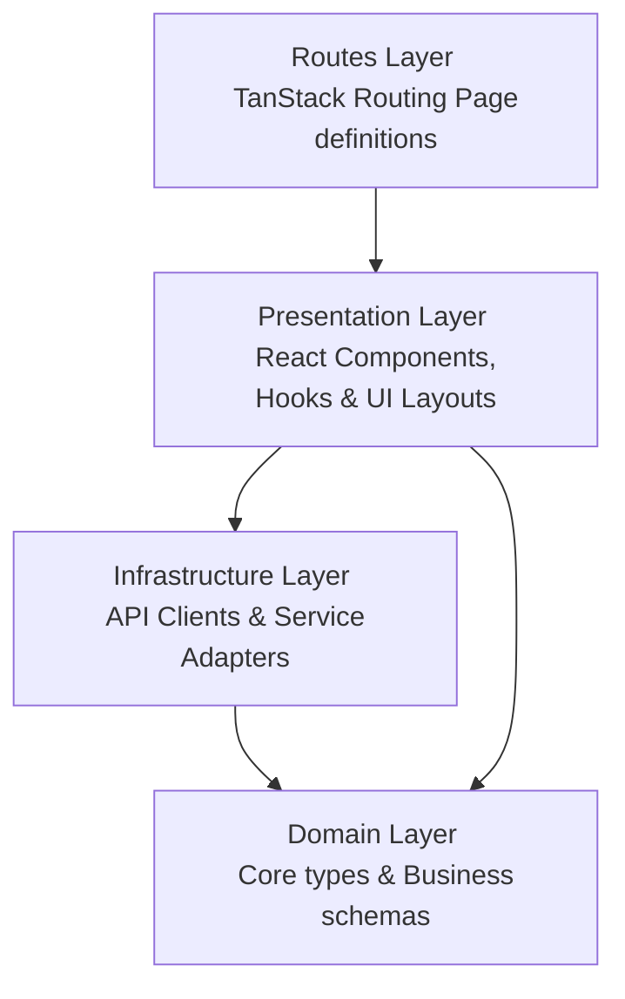

# Kodeversity LMS Client

Welcome to the **Kodeversity LMS Client** (formerly `Kodeversity Nexus` and `template-admin-kit`). This is a unified, single-page application (SPA) built using React, TypeScript, and Bun, structured using **Clean Architecture** principles.

It hosts both the **Student Learning Portal** (with rich interactive animations, coding playgrounds, and course materials) and the **Administrative Dashboard** (with KPI metric analytics, management consoles, and system status checkers).

---

## 🛠️ Technology Stack

- **Runtime & Package Manager:** Bun
- **Build Tool:** Vite
- **UI Framework:** React 19 + Tailwind CSS v4
- **Routing:** TanStack Router (Type-safe, file-system based routing)
- **State Management:** React Context (`AuthContext`) & custom event-driven reactive store (`authStore`)
- **Data Fetching:** TanStack Query (React Query)
- **Animations:** WebGL custom shaders, GSAP, Lenis (Smooth Scroll), Framer Motion, and Tailwind Transitions
- **UI Primitives:** Radix UI (via `shadcn/ui`)

---

## 🏗️ Clean Architecture Layers

The source code (`src/`) is organized into distinct layers to enforce separation of concerns:



1.  **Domain:** The core business definitions, entities, and type schemas. Contains no framework code or external dependencies.
2.  **Infrastructure:** Integrations with external services (HTTP Clients, API service adapters). Communicates with microservices via `apiClient`.
3.  **Presentation:** React views, components, layouts, custom hooks, and styles. Uses shadcn/ui components for primitives.
4.  **Routes:** File-system routes mapped by TanStack Router to pages, using layouts and authentication guards.

---

## 📂 Project Directory Structure

```
lms-client/
├── bunfig.toml                  # Bun configuration file
├── components.json              # shadcn/ui library configuration
├── eslint.config.js             # ESLint rules and setup
├── index.html                   # HTML entry point
├── package.json                 # Project dependencies, scripts, and details
├── package-lock.json            # npm dependency lockfile
├── tsconfig.json                # TypeScript compilation config
├── vite.config.ts               # Vite configuration and plugins
└── src/                         # Application source code
    ├── assets/                  # Static assets (logos, images, etc.)
    ├── domain/                  # Core entities, interface schemas, and types
    ├── infrastructure/          # Services communicating with backend services
    │   ├── admin/               # Administrative analytics and management services
    │   ├── auth/                # Identity provider service adapters
    │   ├── course/              # Catalog and course materials endpoints
    │   ├── http/                # Base client client/network configs
    │   ├── instructor/          # Instructor dashboard service adapters
    │   └── student/             # Student learning service adapters
    ├── main.tsx                 # Client app entrypoint
    ├── router.tsx               # TanStack Router instance and context
    ├── routeTree.gen.ts         # Router-compiled automatic route tree mapping
    ├── styles.css               # Global CSS files and Tailwind directives
    ├── routes/                  # File-system routing definitions
    └── presentation/            # User Interface & state controls
        ├── core-ui/             # Styling primitives (shadcn UI, animations)
        ├── features/            # Feature-specific components, hooks, and logic
        ├── global/              # Global app layouts, shells, and overarching components
        └── lib/                 # Shared helper libraries and utilities
```

---

## 📄 File-by-File Functionality Overview

Below is the detailed list of every folder and source file in the application, along with its specific functionality:

### ⚙️ Root Configuration Files

| File                | Functionality                                                                                                                                  |
| :------------------ | :--------------------------------------------------------------------------------------------------------------------------------------------- |
| `bunfig.toml`       | Controls Bun runtime behavior and package installer behavior.                                                                                  |
| `components.json`   | Configurations for `shadcn/ui` components (specifies aliases, variables, base colors, and directories).                                        |
| `eslint.config.js`  | Configures code validation checks, React-hooks linters, and Prettier integration settings.                                                     |
| `index.html`        | The main HTML container; provides the `<div id="root">` element and references `src/main.tsx`.                                                 |
| `package.json`      | Lists project scripts (`dev`, `build`, `preview`, `lint`, `format`, `typecheck`), third-party packages, and Node environment dev dependencies. |
| `package-lock.json` | Lockfile recording the exact tree of installed npm dependencies.                                                                               |
| `tsconfig.json`     | Configures TypeScript compilation settings, JSX output modes, path aliases (`@/*` to `src/*`), and target types.                               |
| `vite.config.ts`    | Configures Vite, including plugins for React, Tailwind CSS v4, custom paths resolver, and the TanStack Router automatic compiler.              |

---

### 🎨 Static Assets (`src/assets`)

| File                              | Functionality                                                                             |
| :-------------------------------- | :---------------------------------------------------------------------------------------- |
| `src/assets/kodeversity-logo.png` | The main Kodeversity brand logo image, used across header navigation panels and sidebars. |

---

### 🧩 Domain Layer (`src/domain`)

This directory defines core models, interfaces, and roles used throughout the application. It contains no implementation logic.

| File                 | Functionality                                                                                                                                                       |
| :------------------- | :------------------------------------------------------------------------------------------------------------------------------------------------------------------ |
| `admin-analytics.ts` | Defines TS types for the administrative dashboard (KPI metrics, chart data structures, recent activities, systems statuses, and top-selling course tables).         |
| `auth.ts`            | Configures authentication types, including credentials payloads, register schemas, OTP requests/verifications, JWT token contents, and the `UserRole` enum.         |
| `course.ts`          | Defines course curricula blueprints: `Instructor`, `Course`, `Module`, `Chapter`, `Quiz`, `Review`, `Company`, `Lesson`, `Challenge`, and code `Submission` models. |
| `index.ts`           | Barrel exports file exporting all domain models to facilitate clean import statements.                                                                              |
| `progress.ts`        | Types for tracking student learning checkpoints, including active course statistics, completed lessons lists, and progress ratios.                                  |
| `user.ts`            | Defines schemas for `User` profiles, tokens payloads, active browser sessions, and general user properties.                                                         |

---

### 🌐 Infrastructure Layer (`src/infrastructure`)

This layer manages connection to external APIs and maps response models back to the domain models.

#### HTTP & Network Foundation (`src/infrastructure/http`)

| File           | Functionality                                                                                                                                                                                                                                                                                                       |
| :------------- | :------------------------------------------------------------------------------------------------------------------------------------------------------------------------------------------------------------------------------------------------------------------------------------------------------------------ |
| `apiClient.ts` | Central HTTP client utility wrapper using the standard browser `fetch` API. Implements: Bearer token headers injection, 401 interceptors for silent token refresh via HTTP-only cookies, automatic request retries on token refresh, error envelope parsing, and global redirect hooks for unauthenticated actions. |
| `endpoints.ts` | central dictionary mapping all microservice endpoints (Auth, Course, User, Progress, Challenge, Admin) to environment variables or local fallback hosts.                                                                                                                                                            |

#### Backend Adapters (`src/infrastructure/...`)

| File                              | Functionality                                                                                                                                                                   |
| :-------------------------------- | :------------------------------------------------------------------------------------------------------------------------------------------------------------------------------ |
| `admin/analyticsService.ts`       | Fetches administrative overview metrics from the backend. Integrates a rich mock data fallback for testing KPI metrics and Recharts graphs when the API service is unreachable. |
| `admin/liveClassesService.ts`     | Manages scheduling, retrieval, and updates for live instructor-led classes within the administrative portal.                                                                    |
| `admin/managementService.ts`      | Retrieves course directory tables and registered users lists for back-office records management.                                                                                |
| `auth/authService.ts`             | Exposes identity management actions: credentials sign-in, account creation, sessions termination, session refresh, token validation, and email OTP dispatch/verification.       |
| `course/courseService.ts`         | Manages course catalog fetching; resolves courses by their slugs, fetches associated modules/chapters, and retrieves text/video lesson contents.                                |
| `instructor/instructorService.ts` | Provides dashboard and management endpoints for instructors to manage their assigned batches, track meetings, and update curriculum.                                            |
| `student/studentService.ts`       | Consolidates student-specific requests, including tracking lesson completions, fetching course progress percentages, and retrieving user profiles or challenges.                |

---

### 🚪 Root Source Files (`src/`)

| File               | Functionality                                                                                                                                                                                            |
| :----------------- | :------------------------------------------------------------------------------------------------------------------------------------------------------------------------------------------------------- |
| `main.tsx`         | Entrypoint of the React SPA; mounts the app container inside the HTML `#root` element and registers the Router.                                                                                          |
| `router.tsx`       | Configures TanStack Router: sets up QueryClient, injects context, configures scroll restoration by pathname, and registers a global subscriber to update the router context whenever auth states change. |
| `routeTree.gen.ts` | Route tree auto-generated by the TanStack Router compiler based on files located in `src/routes/`.                                                                                                       |
| `styles.css`       | Global styling stylesheet specifying custom animations, CSS variable registers, theme definitions, and Tailwind directives.                                                                              |

---

### 🛣️ Routes Layer (`src/routes`)

This folder manages file-system routing. File names determine page paths.

#### Global Routes & Public Pages

| File                | Functionality                                                                                                                                                                                                                                                    |
| :------------------ | :--------------------------------------------------------------------------------------------------------------------------------------------------------------------------------------------------------------------------------------------------------------- |
| `__root.tsx`        | Root route component that wraps the entire route tree. Provides `QueryClientProvider` and `AuthProvider`, mounts the Lenis `SmoothScroll` and the `Toaster` notifications, and configures global layout frames for 404 (Not Found) and error boundary scenarios. |
| `index.tsx`         | Application home page. Renders the interactive landing hero graphic, brand loop marquees, Magic Bento grids showcasing courses, and the footer.                                                                                                                  |
| `login.tsx`         | User login portal containing email validation screens and link paths for register workflows.                                                                                                                                                                     |
| `register.tsx`      | User registration page containing forms, step flows, and OTP verification wrappers.                                                                                                                                                                              |
| `courses.index.tsx` | General course catalog showcasing active courses, search filter controls, and categories.                                                                                                                                                                        |
| `courses.$slug.tsx` | Detail page for courses. Resolves previews, curriculum modules, instructor panels, pricing structures, and reviews.                                                                                                                                              |
| `community.tsx`     | Public student community discussions page.                                                                                                                                                                                                                       |
| `mentorship.tsx`    | 1-on-1 advisor reservation scheduler dashboard.                                                                                                                                                                                                                  |
| `practice.tsx`      | Catalog repository of general coding challenges and developer environments.                                                                                                                                                                                      |
| `events.tsx`        | Interactive listing showing upcoming live workshops, bootcamps, and webinars.                                                                                                                                                                                    |
| `roadmaps.tsx`      | Learning curriculum maps showcasing dev steps from beginner to advanced roles.                                                                                                                                                                                   |

#### Administrative Routes (Protected)

| File              | Functionality                                                                                                                                                                                                                        |
| :---------------- | :----------------------------------------------------------------------------------------------------------------------------------------------------------------------------------------------------------------------------------- |
| `admin.tsx`       | Administrative route guard layout. Asserts that the authenticated user is a verified administrator before rendering children, redirecting unauthenticated users to `/login` and non-admins to `/`. Mounts the `AdminLayout` wrapper. |
| `admin.index.tsx` | Admin panel home page displaying analytics widgets (KPIs, revenue bars, enrollment distributions, system status monitors, recent activities, and top course metrics).                                                                |

#### Student Routes (Protected)

| File                            | Functionality                                                                                                                         |
| :------------------------------ | :------------------------------------------------------------------------------------------------------------------------------------ |
| `_student.tsx`                  | Pathless route wrapper for student sub-routes. Verifies user authentication and redirects logged-in admins to the `/admin` workspace. |
| `_student.dashboard.tsx`        | Main student hub showing active modules progress, upcoming milestones, recent certificates, and recommendations.                      |
| `_student.certificates.tsx`     | Lists certificates awarded to the student upon completing course curricula.                                                           |
| `_student.challenges.tsx`       | Displays active developer coding challenge tasks, quizzes, and difficulty categories.                                                 |
| `_student.learn.$slug.tsx`      | Course learning player. Features structured video streams, document viewers, and interactive tabs for notes, Q&As, and chapters.      |
| `_student.playground.$slug.tsx` | Dynamic code editor workspace. Integrates real-time code sandboxes for compiler validations.                                          |
| `_student.settings.tsx`         | Allows students to update profile details, upload custom avatars, and change credentials.                                             |

---

### 🎨 Presentation Layer (`src/presentation`)

Houses components, styling systems, context states, hooks, and presentation helper utilities.

#### Core Contexts (`src/presentation/contexts`)

| File              | Functionality                                                                                                                                                                                                                                                 |
| :---------------- | :------------------------------------------------------------------------------------------------------------------------------------------------------------------------------------------------------------------------------------------------------------ |
| `AuthContext.tsx` | Injects authentication states (`user`, `isAuthenticated`, `isLoading`) and actions (`login`, `register`, `logout`, `sendOtp`, `verifyOtp`) via React Context. Auto-triggers silent session restoration via HTTP-only refresh tokens on application bootstrap. |
| `authStore.ts`    | Minimal reactive pub-sub event store. Synchronizes auth state changes synchronously to route guards before route mounting, circumventing async context delays during navigation.                                                                              |

#### Custom Hooks (`src/presentation/hooks`)

| File             | Functionality                                                                                                                               |
| :--------------- | :------------------------------------------------------------------------------------------------------------------------------------------ |
| `useAuth.ts`     | Convenience hook providing clean, type-safe access to parameters and controls inside `AuthContext`.                                         |
| `useCourses.ts`  | Query wrapper (React Query) that fetches and caches course lists, individual courses by slug, and lesson curriculum details.                |
| `use-mobile.tsx` | Detects viewport sizing updates; provides boolean variables indicating if the client is on a mobile device (used to toggle sidebars/menus). |
| `useProgress.ts` | Handles fetching, caching, and updating student course progress percentages and lesson completion statuses.                                 |

#### Shared Layouts (`src/presentation/layouts`)

| File                | Functionality                                                                                                   |
| :------------------ | :-------------------------------------------------------------------------------------------------------------- |
| `AdminLayout.tsx`   | Combines `Sidebar`, `Topbar`, and nested child routes into a unified dashboard grid styled with `.admin-theme`. |
| `StudentLayout.tsx` | Basic layout wrapper for student-facing pages.                                                                  |

#### Helpers & Utilities (`src/presentation/lib`)

| File               | Functionality                                                                                                                      |
| :----------------- | :--------------------------------------------------------------------------------------------------------------------------------- |
| `useAccent.ts`     | State controller that handles global theme hue adjustments, allowing dynamic switches between colors (blue, purple, orange, etc.). |
| `useMouseField.ts` | React Hook tracking screen mouse vectors to feed coordinate positions to WebGL graphics custom shaders.                            |
| `utils.ts`         | Formats Tailwind classes using `clsx` and resolves class naming collisions using `tailwind-merge`.                                 |

#### UI Components (`src/presentation/components/...`)

##### 💼 Admin Components (`components/admin`)

Components used specifically within the administrative dashboard panel.

| File                    | Functionality                                                                                                           |
| :---------------------- | :---------------------------------------------------------------------------------------------------------------------- |
| `Card.tsx`              | Reusable admin panel card container with consistent border styling and background fills.                                |
| `EnrollmentsDonut.tsx`  | Recharts-based donut chart displaying the distribution of course enrollments by topic category.                         |
| `KpiCard.tsx`           | Visual KPI card displaying a value, label, percentage delta indicator, Icon, and a custom inline mini-sparkline.        |
| `OverviewAnalytics.tsx` | Administrative wrapper dashboard component containing key analytics metric graphs.                                      |
| `QuickActions.tsx`      | Grid panel providing triggers for administrative tasks (e.g. creating courses, inviting instructors, editing rosters).  |
| `RecentActivities.tsx`  | Feed displaying recent system events (e.g., student enrollments, quiz completions, assignments posts).                  |
| `RevenueBars.tsx`       | Stacked bar chart (Recharts) displaying monthly revenue income side-by-side with expenses.                              |
| `Sidebar.tsx`           | Vertical navigation sidebar for the admin dashboard panel.                                                              |
| `SystemStatus.tsx`      | Visual list grid displaying health statuses ("healthy", "warning", "error") for gateways, databases, and microservices. |
| `Topbar.tsx`            | Top header for the admin layout, featuring search input bars, notification bells, profile dropdowns, and theme toggles. |
| `TopCategories.tsx`     | Visual listing ranking interest categories by enrollment counts.                                                        |
| `TopCoursesTable.tsx`   | Lists top-performing courses, summarizing sales counts, gross revenues, and student reviews ratings.                    |

##### 🎓 Student Components (`components/student`)

Components used throughout the student-facing platform.

| File                               | Functionality                                                                                                                                                                                |
| :--------------------------------- | :------------------------------------------------------------------------------------------------------------------------------------------------------------------------------------------- |
| `ComingSoon.tsx`                   | Decorative card placeholder for sections under development.                                                                                                                                  |
| `AppShell.tsx`                     | The primary layout shell for student routes. Implements top navbar headers, responsive slide-out drawer menus, global search, shopping cart access, user profile cards, and logout triggers. |
| `animations/ScrollFloat.tsx`       | Text scroll-animation, splitting characters into animated block nodes as the page scrolls.                                                                                                   |
| `animations/ScrollVelocity.tsx`    | Horizontally scrolling parallax text marquee, adjusting scroll speed relative to document scrolling.                                                                                         |
| `animations/TextType.tsx`          | Custom heading typewriter animation, loop-typing keywords.                                                                                                                                   |
| `challenges/ChallengesSection.tsx` | Student challenges portal interface, containing catalogs list view, difficulty filters, and search inputs.                                                                                   |
| `courses/CourseCard.tsx`           | Displays a course's details (thumbnail, instructor avatar, level badge, price, curriculum counts, and enrollment statuses).                                                                  |
| `courses/CoursesSection.tsx`       | Layout container rendering grids of course cards.                                                                                                                                            |
| `courses/data.ts`                  | Hardcoded course profiles used as visual fallbacks or placeholder layouts during local development.                                                                                          |
| `courses/ViewAllCard.tsx`          | Visual navigation link card prompting students to explore the full course catalog directory.                                                                                                 |
| `footer/RevealFooter.tsx`          | Modern scroll-reveal footer containing link structures and decorative brand text.                                                                                                            |
| `learning/LearningSection.tsx`     | The layout panel rendering curricula lists and text components inside the student course player.                                                                                             |
| `hero/AccentToggle.tsx`            | Interface widget containing custom slider buttons to switch theme hue accent classes.                                                                                                        |
| `hero/DotGrid.tsx`                 | Interactive HTML5 canvas grid mapping particle points reacting to mouse proximity.                                                                                                           |
| `hero/Hero.tsx`                    | Main landing hero section displaying bold headings, custom typewriter effects, CTA action links, and HUD graphics.                                                                           |
| `hero/HUDOverlay.tsx`              | Tech-themed HUD grid frame containing visual gauges, terminal logs, and system diagnostics indicators.                                                                                       |
| `hero/LatencyLinks.tsx`            | Diagnostic component that pings servers to measure network latency.                                                                                                                          |
| `hero/NodeSwarm.tsx`               | React Three Fiber ThreeJS component initializing 3D WebGL particle nodes.                                                                                                                    |
| `hero/SwarmCanvas.tsx`             | Mounting canvas for ThreeJS WebGL node simulations.                                                                                                                                          |
| `hero/shaders/index.ts`            | WebGL vertex and fragment custom GLSL shaders code configurations.                                                                                                                           |
| `hero/nav/menuData.ts`             | Configures structured navigational lists for header dropdowns.                                                                                                                               |
| `hero/nav/PlaygroundsMenu.tsx`     | Navigation dropdown menu allowing direct jumps to playgrounds.                                                                                                                               |

##### 🛠️ Core UI Primitives (`components/ui`)

This directory houses reusable, low-level styling primitives (most generated via shadcn/ui and styled with Tailwind CSS variables).

| File                            | Functionality                                                                        |
| :------------------------------ | :----------------------------------------------------------------------------------- |
| `accordion.tsx`                 | Collapsible vertical accordion layouts.                                              |
| `alert-dialog.tsx`              | Modal panels blocking standard workflows until explicitly acknowledged or cancelled. |
| `alert.tsx`                     | Context banners for warnings, alerts, errors, or info blocks.                        |
| `aspect-ratio.tsx`              | Fixed ratio containers preventing image/media layout shifts.                         |
| `avatar.tsx`                    | Circular profile avatar framework with fallback initials.                            |
| `badge.tsx`                     | Custom label pill badges.                                                            |
| `breadcrumb.tsx`                | Directory navigation pathways showing path locations.                                |
| `button.tsx`                    | Unified button component featuring styling variants and sizes.                       |
| `calendar.tsx`                  | Interactive day picker calendar component.                                           |
| `card.tsx`                      | Basic card layout panel wrappers.                                                    |
| `carousel.tsx`                  | Embla Carousel sliding navigation panels.                                            |
| `chart.tsx`                     | Recharts responsive grid layouts and tooltip wrapper helpers.                        |
| `checkbox.tsx`                  | Checkbox toggles.                                                                    |
| `collapsible.tsx`               | Click-to-toggle expandable containers.                                               |
| `command.tsx`                   | Command menu filters for settings and actions search.                                |
| `context-menu.tsx`              | Contextual menus displaying on target right-clicks.                                  |
| `DarkVeil.tsx` / `DarkVeil.css` | Fullscreen transition wipe utilizing smooth CSS vector curves.                       |
| `dialog.tsx`                    | Generic overlay modal windows.                                                       |
| `drawer.tsx`                    | Bottom/side sheets sliding in from viewport edges.                                   |
| `dropdown-menu.tsx`             | Interactive dropdown menus.                                                          |
| `form.tsx`                      | Validation wrappers combining React Hook Form and Zod.                               |
| `hover-card.tsx`                | Previews displaying when hover-focusing active triggers.                             |
| `input.tsx`                     | Text inputs.                                                                         |
| `input-otp.tsx`                 | Box inputs for OTP verification codes.                                               |
| `label.tsx`                     | Form labels.                                                                         |
| `LogoLoop.tsx`                  | Infinite scrolling logo loop marquee.                                                |
| `MagicBento.tsx`                | Custom CSS Grid cards representing highlights features.                              |
| `menubar.tsx`                   | Layout rows providing header dropdowns.                                              |
| `navigation-menu.tsx`           | Header navigations.                                                                  |
| `pagination.tsx`                | Multi-page paginator nodes.                                                          |
| `popover.tsx`                   | Popup cards appearing relative to active elements.                                   |
| `progress.tsx`                  | Progress bars.                                                                       |
| `radio-group.tsx`               | Selection lists.                                                                     |
| `resizable.tsx`                 | Multi-panel splitters containing draggable borders.                                  |
| `scroll-area.tsx`               | Custom styled scrollbars.                                                            |
| `select.tsx`                    | Dropdown option selectors.                                                           |
| `separator.tsx`                 | Thin line dividers.                                                                  |
| `sheet.tsx`                     | Side drawers.                                                                        |
| `sidebar.tsx`                   | Side menus.                                                                          |
| `skeleton.tsx`                  | Pulsing grey boxes representing loading elements.                                    |
| `slider.tsx`                    | Sliding controls for adjustments.                                                    |
| `SmoothScroll.tsx`              | Mounts Lenis smooth scrolling.                                                       |
| `sonner.tsx`                    | Toast notification controllers.                                                      |
| `SplashCursor.tsx`              | HTML5 canvas cursor element tracking cursor movements to draw WebGL fluid ripples.   |
| `switch.tsx`                    | Switch controls.                                                                     |
| `table.tsx`                     | Standard tables.                                                                     |
| `tabs.tsx`                      | Tab controllers.                                                                     |
| `textarea.tsx`                  | Multi-line textareas.                                                                |
| `toggle.tsx`                    | Toggle action buttons.                                                               |
| `toggle-group.tsx`              | Multi-toggle buttons group.                                                          |
| `tooltip.tsx`                   | Tooltips.                                                                            |
